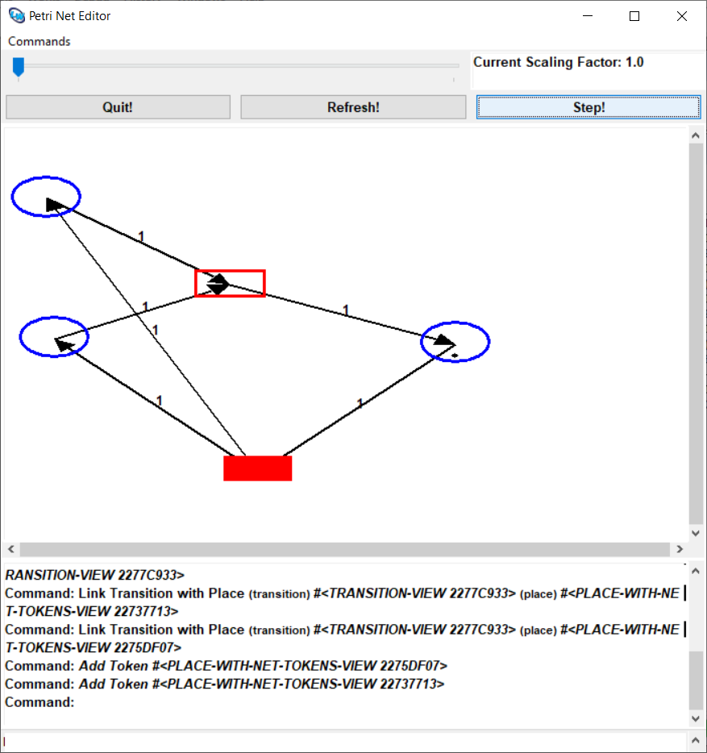

# PetriNets-CLIM-Demo

A simple Petri Net editor and simulator written in Common Lisp using
CLIM (Common Lisp Interface Manager) for its GUI.

## About 

This was written in 2003 for a one [hour presentation / lecture about
CLIM](./clim.pdf) taught by the author to CS students at the
University of Hamburg. The [simple CLIM Petri Net editor & simulator
in this repository](./src/petri4.lisp) was used as a running example
in the lecture. It still compiles with LispWorks 6.1 CLIM.

## Linux / Motif CLIM 

## Windows CLIM 

 

