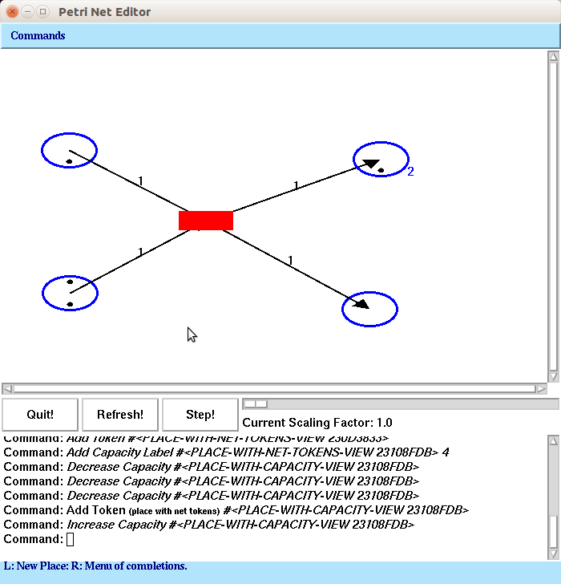

# PetriNets-CLIM-Demo

A simple Petri Net editor and simulator written in Common Lisp using CLIM (Common Lisp Interface Manager) for the GUI. 

This was written in 2003 for a one [hour presentation / lecture about CLIM](./clim.pdf) taught by the author to CS students at the University of Hamburg.

The [Common Lisp / CLIM Petri Net editor / simulator program](src/petri2.lisp) was used as a running example in this lecture. It still compiles with LispWorks 6.1 and CLIM, under Ubuntu / Linux using the Motif port of CLIM. 